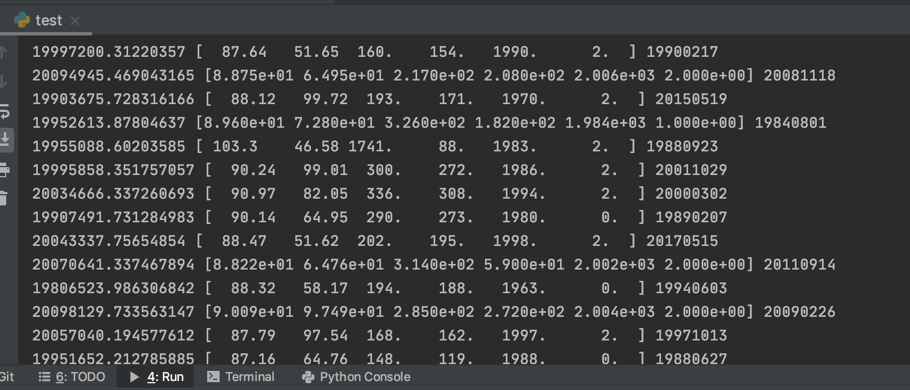

## Our Models

### First iteration

We started by training a simple model with the SATCAT data available to us from Space-Track.org

How2, our first model, took an input of 6 attributes and tried to predict the decay date of an object based on those values, running them through a linear regression algorithm.

This basic algorithm resulted in a prediction that had 43% accuracy.

Which was not the best. 

Here is one of poor How2's first attempt at guessing the date (his prediction is on the left and the real decay date is on the right)

>Attributes from left to right include, predicted date, period, inclination, apogee, perigee, RCS Size, launch year and the real decay date

We attempted to include some different attributes to see if that would influence the accuracy of the predictions. However our ultimate conclusion was that the data would require a more complex algorithm to make the kind of predictions we were requiring from it. 

Orbital decay had many more influencing factors than regression or categorisation could handle. 

We also had an issue with the format of the data. How2 didn't know that the integer we fed to him was originally a timestamp. His predictions were therefore not capable of being transferred back to the correct data type.  

### Second Iteration

We decided to solve the issue with the data format first. Integrating How2 with our web framework and data visualisation before attempting to upgrade the model.
This could potentially moving his training off of the parameters we had fed him here and giving him TLE data instead. 

